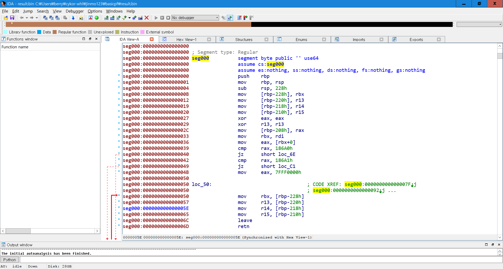

## basicpf

basicpf는 BPF 어셈블리라는 생소한 플랫폼에 대한 어셈블리 분석을 해야하는 문제입니다. 저는 간단한 SBOX+XOR 암호를 개발하였습니다.

## 문제 개요

문제로 주어진 바이너리는 seccomp filter와 syscall을 통해서 BPF 어셈블리어로 된 필터를 실행 후 리턴값을 얻어옵니다. 리턴값은 암호문 생성에 사용됩니다.

seccomp의 필터는 BPF 어셈블리를 통해 이루어지는데 이를 리버싱하는 방법에는 크게 두 가지가 있습니다.

1. BPF 디스어셈블리 툴을 구해서 쓴다.
2. bpf를 JIT컴파일하는 툴을 이용하여 bpf 어셈블리를 다른 형태로 바꾼다.

이 둘을 이용하여 해당 필터가 수행하는 암호화 연산을 분석할 수 있습니다.

## 루틴 분석

C 단의 루틴은 아래와 같습니다. (pseudo code)

```c
void box(int *z) {
	int result[4] = {0, };
	for(int i = 0; i < 16; i++) {
		result[i >> 2] |= ((-syscall(SYSCALL_BOX, z[0], z[1], z[2], z[3], i)) & 0xff) << (i * 8);
	}
	memcpy(z, result, 16);
}

int check(int a, int b, int c, int d) {
	return -syscall(SYSCALL_CHECK, a, b, c, d) == 1;
}


// .. init seccomp
	for(int i = 0; i < 16; i++)
		box(z);

	if(!check(z[0], z[1], z[2], z[3]))
		_error("wrong.");

```

여기서 BPF로 된 암호화 루틴을 호출하는 핵심 루틴인 syscall에서는 각각 암호문 체크 및 암호화를 위해 다른 시스템콜 번호를 쓰고 있습니다. 이제 BPF 안의 루틴을 보겠습니다. 저는 위에서 언급한 두 가지 방법 중 두 번째 방법을 이용하여 분석해보도록 하겠습니다.

## BPF-JIT

2번 방법을 시행하기 위해서는 커널의 런타임 옵션을 제어하여 BPF가 커널 내에서 JIT 컴파일되어 실행되는 것을 활성화하여야 합니다. 해당 옵션 중에는 생성된 JIT 코드를 출력해주는 옵션도 있습니다. 아래와 같이 하면 됩니다. ([출처](http://www.gnoobz.com/hitb-ctf-2016-binary-300.html))

```
# sudo su
# echo 2 > /proc/sys/net/core/bpf_jit_enable
```

그 후 16글자를 맞추고 해당 프로그램을 실행하면 아래와 같이 JIT 코드가 dmesg를 보았을 때 덤프됩니다.

```
[45886.028745] flen=623 proglen=3748 pass=5 image=0000000000000000 from=basicpf pid=22184
[45886.029156] JIT code: 00000000: 55 48 89 e5 48 81 ec 28 02 00 00 48 89 9d d8 fd
[45886.029495] JIT code: 00000010: ff ff 4c 89 ad e0 fd ff ff 4c 89 b5 e8 fd ff ff
[45886.029815] JIT code: 00000020: 4c 89 bd f0 fd ff ff 31 c0 4d 31 ed 48 89 85 f8
[45886.030201] JIT code: 00000030: fd ff ff 48 89 fb 8b 43 00 48 81 f8 a0 86 01 00
[45886.030543] JIT code: 00000040: 74 2c 48 81 f8 a1 86 01 00 74 76 b8 00 00 ff 7f
[45886.030863] JIT code: 00000050: 48 8b 9d d8 fd ff ff 4c 8b ad e0 fd ff ff 4c 8b
[45886.031341] JIT code: 00000060: b5 e8 fd ff ff 4c 8b bd f0 fd ff ff c9 c3 8b 43
[45886.031784] JIT code: 00000070: 10 48 81 f8 53 10 14 67 74 07 b8 00 00 05 00 eb
[45886.032139] JIT code: 00000080: cf 8b 43 18 48 81 f8 4f 2d 25 1f 74 07 b8 00 00
...
```

해당 옵코드를 파싱하기 위해 아래와 같은 코드를 짰습니다.

```
import sys

f = open('result.bin', 'wb')
for line in sys.stdin:
  f.write(line.split(':')[-1].replace(' ', '').strip().decode('hex'))
  f.flush()
f.close()
```

이제 result.bin에 x64로 되어있는(32비트 우분투의 경우 x86) 옵코드가 덤프됩니다. 이는 nasm 등의 디스어셈블러나 IDA Pro로 볼 수 있는 형태입니다.



일단 BPF의 루틴은 아래와 같습니다.

```c
if(syscall_number == SYSCALL_CHECK) {
	// some comparison
	if(a0 == 0x67141053 && ..) {return SECCOMP_RET_ERRNO | 1;}
	else {return SECCOMP_RET_ERRNO | 0;}
} else if(syscall_number == SYSCALL_BOX) {
	// some encryption
	uint32_t b[4] = {
	a0 ^ K0,
	a1 ^ K1,
	a2 ^ K2,
	a3 ^ K3};
	return sbox[b[a4 / 4] >> (a4 % 4 * 8) & 0xff];
}
```

이를 해결하기 위해 아래와 같은 파이썬 코드를 작성하였습니다.

```python
import struct

s = 1729368147, 522530127, 694632550, 205075210
sbox = 0x16c,0x160,0x134,0x120,0x13f,0x131,0x15f,0x124,0x139,0x145,0x16b,0x13b,0x17c,0x156,0x146,0x11c,0x165,0x16d,0x159,0x162,0x121,0x14e,0x179,0x147,0x17a,0x10a,0x12c,0x13d,0x15b,0x169,0x12e,0x153,0x119,0x14c,0x133,0x101,0x142,0x178,0x14a,0x174,0x100,0x12a,0x16e,0x114,0x11b,0x148,0x10f,0x12d,0x113,0x15e,0x13e,0x122,0x106,0x118,0x125,0x144,0x107,0x127,0x167,0x149,0x137,0x15a,0x17b,0x171,0x152,0x170,0x163,0x117,0x16a,0x111,0x166,0x177,0x158,0x164,0x17f,0x104,0x140,0x16f,0x161,0x129,0x12b,0x12f,0x155,0x13a,0x11f,0x10b,0x143,0x130,0x123,0x13c,0x136,0x115,0x110,0x126,0x175,0x11e,0x135,0x102,0x112,0x10e,0x132,0x116,0x14b,0x11d,0x173,0x105,0x17e,0x176,0x15d,0x15c,0x128,0x172,0x157,0x108,0x10c,0x154,0x14d,0x151,0x10d,0x11a,0x17d,0x141,0x109,0x168,0x138,0x103,0x150,0x14f,0x180,0x181,0x182,0x183,0x184,0x185,0x186,0x187,0x188,0x189,0x18a,0x18b,0x18c,0x18d,0x18e,0x18f,0x190,0x191,0x192,0x193,0x194,0x195,0x196,0x197,0x198,0x199,0x19a,0x19b,0x19c,0x19d,0x19e,0x19f,0x1a0,0x1a1,0x1a2,0x1a3,0x1a4,0x1a5,0x1a6,0x1a7,0x1a8,0x1a9,0x1aa,0x1ab,0x1ac,0x1ad,0x1ae,0x1af,0x1b0,0x1b1,0x1b2,0x1b3,0x1b4,0x1b5,0x1b6,0x1b7,0x1b8,0x1b9,0x1ba,0x1bb,0x1bc,0x1bd,0x1be,0x1bf,0x1c0,0x1c1,0x1c2,0x1c3,0x1c4,0x1c5,0x1c6,0x1c7,0x1c8,0x1c9,0x1ca,0x1cb,0x1cc,0x1cd,0x1ce,0x1cf,0x1d0,0x1d1,0x1d2,0x1d3,0x1d4,0x1d5,0x1d6,0x1d7,0x1d8,0x1d9,0x1da,0x1db,0x1dc,0x1dd,0x1de,0x1df,0x1e0,0x1e1,0x1e2,0x1e3,0x1e4,0x1e5,0x1e6,0x1e7,0x1e8,0x1e9,0x1ea,0x1eb,0x1ec,0x1ed,0x1ee,0x1ef,0x1f0,0x1f1,0x1f2,0x1f3,0x1f4,0x1f5,0x1f6,0x1f7,0x1f8,0x1f9,0x1fa,0x1fb,0x1fc,0x1fd,0x1fe,0x1ff,
invsbox = {}
for i, c in enumerate(sbox):
	invsbox[c & 0xff] = i
for i in range(16):
	x = struct.pack("<4I", *s)
	x = bytearray(x)
	x = map(lambda x: invsbox[x], x)
	x = str(bytearray(x))
	s = struct.unpack("<4I", x)
	s = list(s)
	s[0] ^= 1920232565
	s[1] ^= 1702059873
	s[2] ^= 1701999971
	s[3] ^= 2036689759
print map(hex, s)
print struct.pack("<4I", *s)
```

스크립트의 결과로는 `youarebpfmaster!`가 출력되며, 이를 프로그램의 입력으로 넣어보면 플래그가 CYKOR{youarebpfmaster!}라는 것을 알려줍니다.

이 문제 또한 emscripten과 마찬가지로 생소한 플랫폼에서의 일반적인 프로그램에 대한 분석 능력을 검증하기 위한 문제입니다.